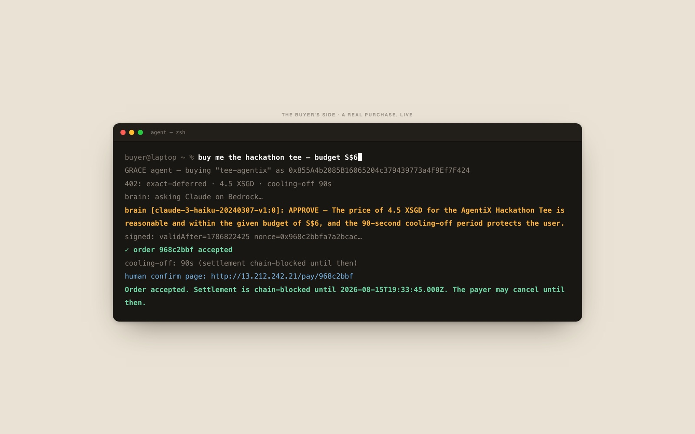
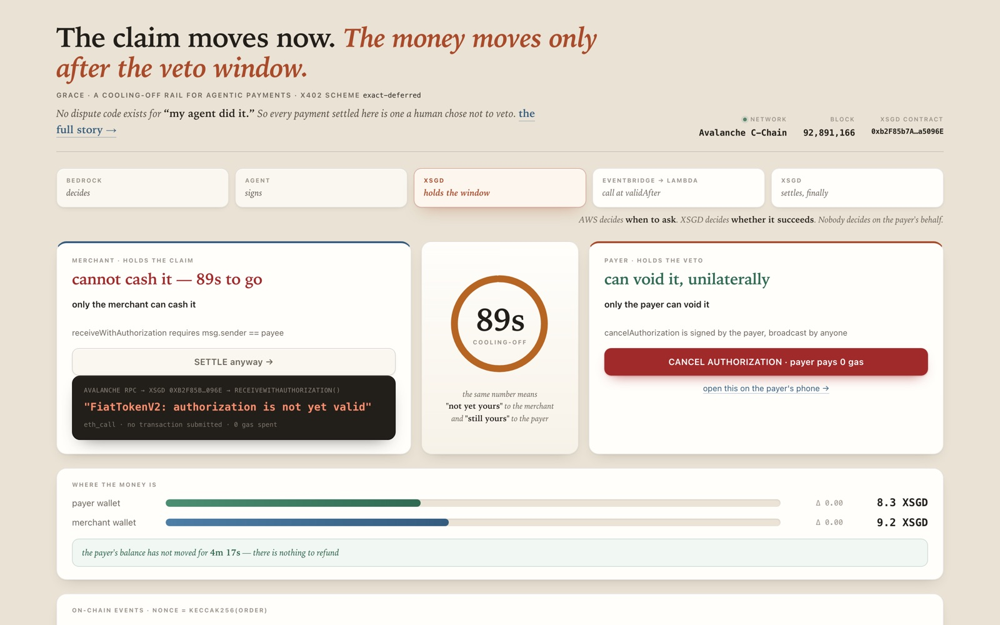
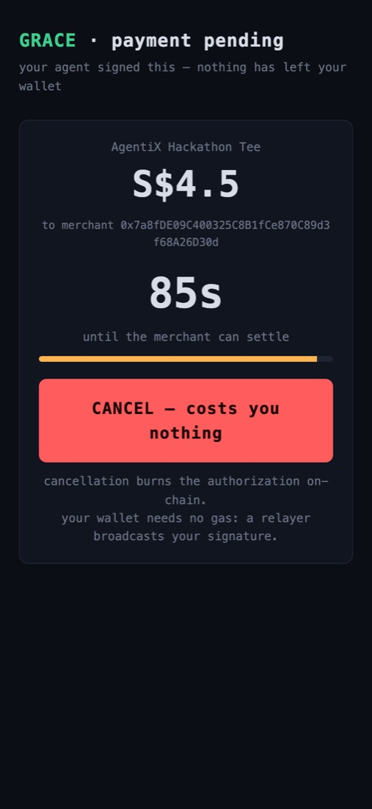
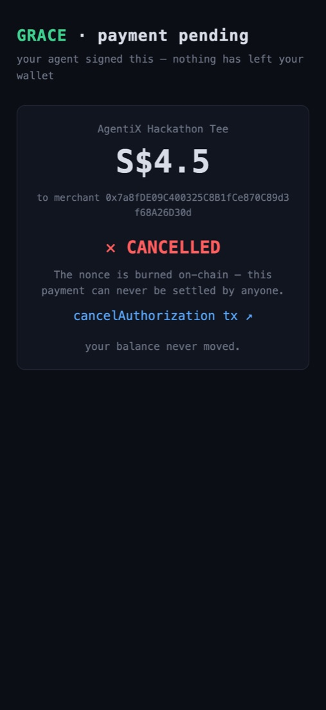
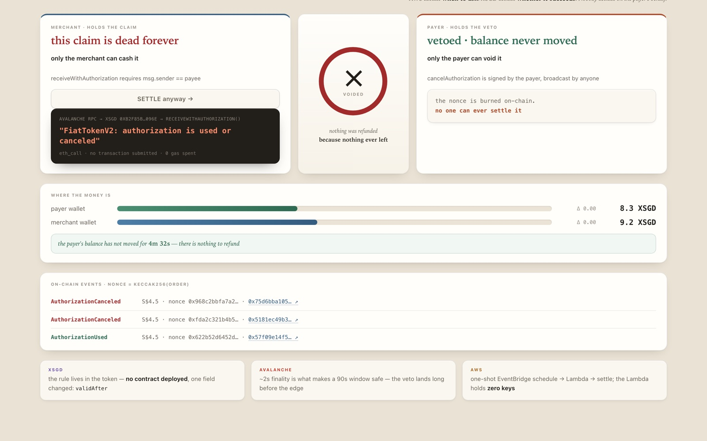
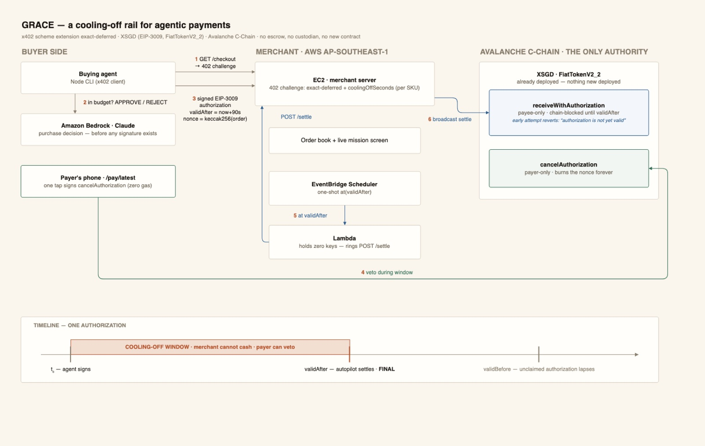

# GRACE — a cooling-off rail for agentic payments

**Track 3 · AI-native Commerce · StraitsX AgentiX Playground 2026**

> **Everyone else makes agents pay. GRACE makes merchants able to accept.**
> A pre-settlement intent check built from one field of EIP-3009 that everyone else
> hardcodes to zero — no escrow, no custodian, no new contract.

## The 90-second tour

1. **The proof** — `npm i && node grace/prove.mjs` · 16 checks, 8 of them decided
   by the deployed token itself against live mainnet state. No keys, no gas.
   Start here: it needs nothing from me.
2. **The gap, reproduced** — `node grace/facilitator-probe.mjs` · sends two payloads
   to two live public facilitators, identical but for `validAfter`. The backdated one
   is accepted; the future-dated one is refused with
   `invalid_exact_evm_payload_authorization_valid_after`. That refusal is the thing
   the proposal exists to change, tested rather than asserted.
3. **The receipts** — the mainnet transactions linked below, including one settled
   by a scheduler with no human in the loop.
4. **The proposal** — [`grace/specs/`](grace/specs) · the flow and its two bindings,
   written against the x402 spec templates, under discussion in
   [x402-foundation/x402#3182](https://github.com/x402-foundation/x402/issues/3182)
   and [#3208](https://github.com/x402-foundation/x402/issues/3208).
5. **The screen** — `node grace/server.mjs`, then <http://localhost:4021> · the live
   rail runs locally. Press *SETTLE anyway* during a window and read the token
   contract's own refusal; open the payer's page and cancel for real.
6. **The minute** — the [1-minute demo video](https://drive.google.com/file/d/1ZJzYq1PoK63VeHTzB_PIGbRwee5hr6Dg/view):
   every frame in it is a real mainnet transaction.

> The hosted demo that was at `13.212.242.21` ran on hackathon-provided AWS and went
> away with the event. Nothing above depends on it: the proof suite talks to Avalanche
> directly, the receipts are on-chain forever, and the screen runs on your machine.

---

## Seen, not told — real frames from the live rail

**The agent buys.** A real x402 purchase; a Claude model on Bedrock approves
*before any signature exists* — and its reasoning is part of the record:



**The merchant holds a claim it cannot cash.** Press *SETTLE anyway* during the
window and the token contract itself answers — no transaction, no gas, just the
chain's verdict:



**The payer keeps the last word in this demo.** `/pay/latest` on the separately
controlled payer wallet signs `cancelAuthorization`; the configured demo relayer pays
the gas, and the nonce is burned on-chain forever:

<p align="center">
  
  &nbsp;&nbsp;
  
</p>

**The ledger tells the whole story.** `AuthorizationCanceled` and
`AuthorizationUsed` side by side — same rail, two human decisions; the balances
carry a running *unchanged for* timer because "nothing moved" should be
measured, not asserted:



---

## The problem no chargeback code covers

An AI agent places an order. The merchant cannot tell whether the principal behind it
actually wanted this — a misread instruction and a triple-fired checkout look identical
to a legitimate purchase. Prompt-injection protection additionally requires a payer
signer or recovery authority that the agent does not exclusively control. In card land, disputes have
no reason code for *"my agent did it"*. On-chain, settlement is instant and final,
so the buyer's protection is zero. Result: rational merchants must reject or
surcharge agent traffic, and rational humans won't hand real money to agents.
Agentic commerce is deadlocked from both sides.

Today's answers both fail the same way: escrow contracts and PSP holds *take the
money first* in order to maybe give it back later.

## The mechanism: one field, already deployed

XSGD is Circle-standard FiatTokenV2_2. Every EIP-3009 authorization carries
`validAfter` — and every production integration sets it to a time in the past.
Set it to the near future instead and a dormant field becomes a cooling-off rail:

```
validAfter  = now + coolingOffSeconds   ← until then, the CHAIN refuses settlement
validBefore = validAfter + settleBy     ← after that, the claim lapses on its own
nonce       = keccak256(order‖salt)     ← settlement events commit to what was bought
```

During the window the merchant holds a signed, amount-locked, payer-bound claim
that **nobody on earth can cash yet** — while the payer keeps a unilateral veto:

| power | who | enforced by |
|---|---|---|
| cash the claim | merchant only | `receiveWithAuthorization` — caller must be the payee |
| void the claim | payer only | `cancelAuthorization` — meta-tx, anyone may pay its gas |

Neither party can do the other's job. No third party can do either. **No escrow,
no custodian, no new contract** — the money never leaves the payer's wallet, so
"reversal" costs nothing: nothing moved.

Cancellation being a meta-transaction matters: it is **relayable**. A phone holding zero
AVAX can cancel only when a funded relayer is available and lands the payer-signed
transaction; direct self-broadcast remains the fallback.

## The protocol: a `cooling-off` payment flow on stock `exact`

The 402 challenge gains two fields, everything else is stock x402:

```json
{ "scheme": "exact",
  "asset":  "0xb2F85b7AB3c2b6f62DF06dE6aE7D09c010a5096E",
  "amount": "4500000", "payTo": "<merchant>",
  "extra":  { "name": "XSGD", "version": "2",
              "coolingOffSeconds": 90, "settleBySeconds": 3600 } }
```

- `coolingOffSeconds: 0` degrades to today's `exact` scheme — fully backwards compatible.
- The window is **declared by the merchant per SKU**: physical goods that ship in
  days cost nothing to protect for 90 seconds; instant digital goods set 0.
  Cooling-off becomes a trust signal merchants compete on, like "free returns".
- Works only on a deployed EIP-3009 implementation whose cancellation, timing, event,
  and (for smart wallets) ERC-1271 capabilities have been probed or allowlisted.

## Proven on mainnet, with real money

Full loop executed on Avalanche C-Chain (43114) against live XSGD:

| beat | evidence |
|---|---|
| order accepted, settlement chain-blocked | console shows the chain's own verdict: `FiatTokenV2: authorization is not yet valid` |
| forced early settle | reverts with the same string — the chain polices the window, not our server |
| payer cancels in-window | [`cancelAuthorization` tx](https://snowtrace.io/tx/0xd5bab3abf1cf09e8ff67d94d85f0c6fabdee47aa4d16cf6196622863f7709cdd) — payer's balance never moved |
| settle after cancel | reverts forever: `FiatTokenV2: authorization is used or canceled` |
| un-cancelled order settles | [`receiveWithAuthorization` tx](https://snowtrace.io/tx/0xf6ccdc44fdc93ad3bc46242f41f9e636cad43c90e5202f2e89fee73525c593db) — S$4.50 settled, final |

Plus `prove.mjs`: 16 checks, of which 8 are answered by the deployed contract via
`eth_call` (payee binding, forged-cancel rejection, burned-nonce replay, the window
gate itself) and the rest are local properties of the commitment. No contract
deployed, no gas spent. The suite prints the split rather than counting them as one
number.

These checks prove token mechanics, not a production asynchronous protocol. The
production proposal requires a durable coordinator, HTTP 202/status/cancel semantics,
restart recovery, an independent-authority profile for human-over-agent claims, a named
relayer, and a `cancelBy` safety margin. The EventBridge hack demo below predates those
requirements and is not presented as a conforming coordinator.

## What ran on AWS, while it ran

*Hackathon-provided account, reclaimed after the event — described here because the
mainnet transactions it produced are still verifiable, not because it is still up.*

Merchant service on **EC2** (ap-southeast-1).

**GRACE Autopilot** — on every accepted order the merchant creates a one-shot
**EventBridge Scheduler** schedule at `validAfter`, which wakes a **Lambda** that
rings the merchant's settle endpoint. The Lambda holds **zero keys**; the chain
stays the only authority. The merchant never presses a button — humans only ever
say no. Measured end to end: window opened 09:05:31Z, final on-chain 09:06:13Z.

If the payer vetoed during the window, the schedule still fires and settlement
reverts with `authorization is used or canceled`. In the Lambda log that is not
an error, it is the product working.

**Bedrock** hosts the buying agent's purchase-decision brain, consulted before any
signature exists — it approves in-budget carts and refuses over-budget ones
outright. That is advisory, not the guarantee: the guarantee is the cooling-off
window, because GRACE assumes agents will sometimes be wrong.



Source: [`grace/architecture.drawio`](grace/architecture.drawio)
· [open in viewer](https://viewer.diagrams.net/?lightbox=1&url=https%3A%2F%2Fraw.githubusercontent.com%2FzjzJoez%2Fgrace-x402%2Fmain%2Fgrace%2Farchitecture.drawio)

## Honest edges

- **GRACE guarantees intent-finality, not solvency.** The payer could drain the
  wallet mid-window. The merchant's flow is *settle-then-ship*: a failed
  settlement is a lost sale, never a lost good. Merchant downside is strictly zero.
- **Scope**: deferred-fulfilment commerce. Instant delivery keeps `window = 0`.
- Settlement is merchant-broadcast (existing facilitators would settle instantly
  and revert). A facilitator adopts the scheme by adding one rule: settle at
  `validAfter`, not on receipt.

## See it

`node grace/server.mjs` → **<http://localhost:4021>** — one live screen. The countdown sits between the two
parties on purpose: the same number means *"you cannot cash this"* to the merchant
and *"you can still kill this"* to the payer. Below it, both balances carry a
running "unchanged for" timer, because *nothing moved* is the claim and it should
be measured rather than asserted.

## Run it yourself

```bash
npm i                                   # viem only
node grace/prove.mjs                    # 16 checks, 8 decided on mainnet — no keys, no gas
node grace/server.mjs                   # merchant → http://localhost:4021
node grace/agent.mjs --sku tee-agentix --server http://localhost:4021 [--brain]
```

`prove.mjs` is the one to run if you only run one: it asserts every claim in this
README against live Avalanche mainnet state, from a throwaway key, spending nothing.

```
grace/
├── lib/xsgd.mjs           chain constants, ABI, revert strings (all live-verified)
├── lib/authorization.mjs  deferred-payment + cancellation signing, order-hash nonce
├── lib/settle.mjs         settle / cancel / simulate, revert classification
├── lib/brain.mjs          Bedrock purchase decision, taken before any signature exists
├── server.mjs             merchant: x402 exact/cooling-off endpoint + order book + autopilot
├── mission.mjs            the live screen
├── themes.mjs             visual themes; ?theme=<key>, ?picker=1 to compare
├── agent.mjs              buyer agent CLI
├── prove.mjs              adversarial proof suite against live mainnet
└── architecture.drawio    functional blocks, AWS deployment, data flow
```

*One line we want to leave behind:*
**No one needs to hold your money in order to give it back.**
